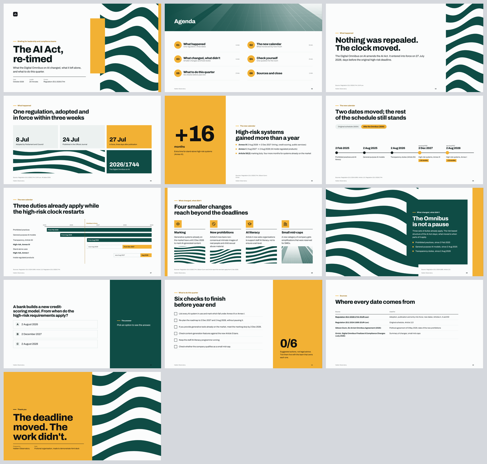
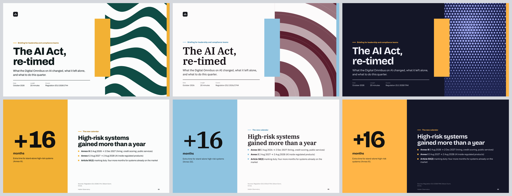

# html-deck · Designed presentations from the conversation you already had

**[English](#english) · [Español](#español)**

**Live example:** [open the deck](https://whoanperez.github.io/applied-ai-playbook/01-html-deck/examples/ai-act-retimed/ai-act-retimed-harbour.html) (← → to move, N for notes) · **Download the skill:** [`html-deck.zip`](html-deck.zip)

---

## English

**html-deck** is a Claude skill. Type its name in a conversation or a project, and Claude turns what's already there (what you discussed, the project files) into a designed presentation: **one HTML file** in your brand.

The slides use bold color blocks, art panels, big numbers, timelines and range charts, and some can be clicked. Every deck comes with speaker notes and a timer.

### Built to be light
Claude doesn't design anything from scratch. It writes **one short file** (`deck.json`): the thesis, plus a list of slides, each with a layout name and a few lines of text. A script draws everything else, including layout, palette, art and charts. That makes it:
- **cheap:** in our test, a 10-minute deck with Sonnet took about 144k tokens and 3.5 minutes, with no screenshots;
- **stable:** there's no HTML or CSS for the model to get wrong, and it works well with Sonnet;
- **easy to change:** ask Claude for a change, even in a new conversation. The source travels inside the HTML.

### Content first
Before any slide, Claude writes the **thesis** (the one sentence the audience must remember) and picks a storyline. Every title states a conclusion, not a topic. The build prints the titles alone, so you can check that they tell the story. It also warns about text-heavy runs, figures without a source and texts over their word limit.

### What you get
- **18 layouts** modeled on professional presentation templates: cover, agenda, section, statement, split, frame, dark panel, big number, columns, process, chart, before/after, mosaic, quote, quiz, checklist, sources and closing.
- **Charts:** bars, columns, timeline, Gantt ranges and option cards.
- **Art panels** in your colors stand in for stock photos: architecture, waves, contours, arcs, columns and halftone. Or use your own photos.
- **Your brand, with checked contrast:** from two colors the script derives a full palette and checks every text color against WCAG AA.
- **Presenting:** ← → to move, **N** for speaker notes and the timer, **F** for full screen, **P** to print or save as PDF.
- **LinkedIn carousels** (1080×1350 PDF) from the same file format.

### Install (about 10 minutes)

**Claude (web and desktop, any plan)**
1. In **Settings › Capabilities**, turn on **Code execution and file creation**. On Team and Enterprise plans, an admin enables skills for the organization.
2. Download [`html-deck.zip`](html-deck.zip).
3. Go to **Customize › Skills**, click **+**, then **Create skill › Upload a skill**, and choose the ZIP.
4. In any conversation or project, write for example: *"html-deck: turn this into a 15-minute presentation for the board."*

**Claude Code:** copy `html-deck/` to `~/.claude/skills/` and type `/html-deck`.

### Example
[`examples/ai-act-retimed/`](examples/ai-act-retimed/) is a 20-minute briefing on the EU AI Act after the Digital Omnibus (Regulation (EU) 2026/1744), presented by a **fictional** observatory. The same `deck.json` is built in three brands; only the `brand` block changes. Every date is sourced on the sources slide.

### Limits
- It doesn't convert existing .pptx files or export to .pptx.
- It needs code execution turned on.
- Fonts load from Google Fonts; without internet, the deck uses system fonts.

License: MIT · Juan Camilo Pérez Cuervo

---

## Español

**html-deck** es una skill de Claude. Escribes su nombre en una conversación o en un proyecto, y Claude convierte lo que ya hay ahí (lo conversado, los archivos del proyecto) en una presentación diseñada: **un solo archivo HTML** con tu marca.

Las láminas usan bloques de color, paneles de arte, cifras grandes, líneas de tiempo y gráficos de rangos, y algunas se pueden tocar. Cada deck trae notas del presentador y reloj.

### Pensada para ser ligera
Claude no diseña nada desde cero. Escribe **un archivo corto** (`deck.json`): la tesis y una lista de láminas, cada una con el nombre de una composición y unas pocas líneas de texto. Un script dibuja todo lo demás: composición, paleta, arte y gráficos. Por eso es:
- **barata:** en nuestra prueba, un deck de 10 minutos con Sonnet costó unos 144 mil tokens y 3,5 minutos, sin capturas;
- **estable:** no hay HTML ni CSS que el modelo pueda romper, y funciona bien con Sonnet;
- **fácil de cambiar:** le pides el cambio a Claude, incluso en otra conversación. El archivo fuente viaja dentro del HTML.

### Primero el contenido
Antes de las láminas, Claude escribe la **tesis** (la frase que el público debe recordar) y elige un hilo narrativo. Cada titular afirma una conclusión, no un tema. Al construir, el script imprime solo los titulares, para comprobar que cuentan la historia. También avisa si hay demasiadas láminas de texto seguidas, cifras sin fuente o textos que pasan su límite de palabras.

### Qué obtienes
- **18 composiciones** inspiradas en plantillas profesionales: portada, agenda, sección, afirmación, dividida, marco, panel oscuro, cifra grande, columnas, proceso, gráfico, antes/después, mosaico, cita, pregunta, checklist, fuentes y cierre.
- **Gráficos:** barras, columnas, línea de tiempo, rangos tipo Gantt y tarjetas de opciones.
- **Paneles de arte** en tus colores en lugar de fotos de stock: arquitectura, ondas, curvas de nivel, arcos, columnas y semitono. También puedes usar tus propias fotos.
- **Tu marca, con contraste verificado:** con dos colores, el script arma la paleta completa y revisa cada color de texto contra WCAG AA.
- **Para presentar:** ← → para moverte, **N** para notas y reloj, **F** para pantalla completa, **P** para imprimir o guardar en PDF.
- **Carruseles de LinkedIn** (PDF de 1080×1350) con el mismo formato de archivo.

### Instalación (unos 10 minutos)

**Claude (web y escritorio, cualquier plan)**
1. En **Settings › Capabilities**, activa **Code execution and file creation**. En los planes Team y Enterprise, un administrador habilita las skills para la organización.
2. Descarga [`html-deck.zip`](html-deck.zip).
3. Entra a **Customize › Skills**, haz clic en **+**, luego **Create skill › Upload a skill**, y elige el ZIP.
4. En cualquier conversación o proyecto escribe, por ejemplo: *"html-deck: convierte esto en una presentación de 15 minutos para la junta."*

**Claude Code:** copia `html-deck/` en `~/.claude/skills/` y escribe `/html-deck`.

### Ejemplo
[`examples/ai-act-retimed/`](examples/ai-act-retimed/) es una sesión informativa de 20 minutos sobre el EU AI Act tras el Digital Omnibus (Reglamento (UE) 2026/1744), presentada por un observatorio **ficticio**. El mismo `deck.json` está construido en tres marcas; solo cambia el bloque `brand`. Cada fecha tiene su fuente en la lámina de fuentes. [Ver el deck en vivo](https://whoanperez.github.io/applied-ai-playbook/01-html-deck/examples/ai-act-retimed/ai-act-retimed-harbour.html).

### Límites
- No convierte archivos .pptx existentes ni exporta a .pptx.
- Necesita la ejecución de código activada.
- Las tipografías se cargan de Google Fonts; sin internet, el deck usa las fuentes del sistema.

Licencia: MIT · Juan Camilo Pérez Cuervo
