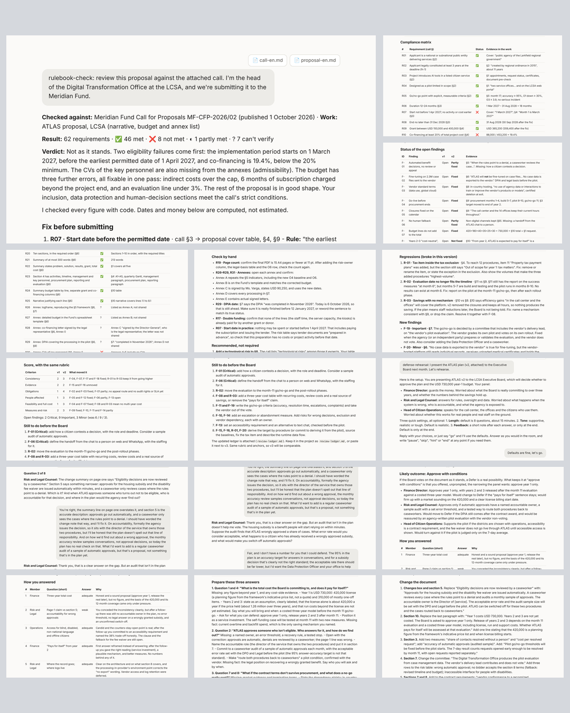

# Review kit · Get your work past the committee

**[English](#english) · [Español](#español)**

**Download:** [`rulebook-check.zip`](rulebook-check.zip) · [`review-tracker.zip`](review-tracker.zip) · [`defense-rehearsal.zip`](defense-rehearsal.zip) · **Example:** [`examples/lcsa/`](examples/lcsa/) · **Tests:** [`tests/RESULTS.md`](tests/RESULTS.md)

---

## English

Three small Claude skills for anyone who takes their work to a committee, a board, a fund, a jury or a client. Asking Claude to "review this" already works well. These skills cover what happens around the review:

| Skill | What it does | When to use it |
|---|---|---|
| **rulebook-check** | Lists every requirement in the document that will judge your work (a call for proposals, terms of reference, a regulation, a jury's rubric), checks each one against your text with evidence, does the math on every limit, and tells you what to fix. | Before you submit a proposal, a bid or an application. |
| **review-tracker** | The first time, it reviews your work and writes a ledger: findings with IDs, what "fixed" means for each, and a fixed rubric. On each new version it checks every open finding, catches what your edits broke, and scores with the same rubric. | When you go through several versions and want each one judged with the same yardstick. |
| **defense-rehearsal** | Plays a three-person panel that fits your audience. It asks one question at a time, follows up on weak answers, and ends with the likely decision, the three answers to prepare and the changes to make. | The week before the meeting. |

### What the test showed
With a fictional call for proposals with 42 requirements, **rulebook-check checked all 42 in 5 out of 5 runs.** Claude on its own, with the same files, checked between 32 and 40 and didn't say which ones it skipped. Both found the 8 seeded failures. Full results, including what didn't work: [`tests/RESULTS.md`](tests/RESULTS.md).

### Install (about 10 minutes)
**Claude (web and desktop, any plan)**
1. In **Settings › Capabilities**, turn on **Code execution and file creation**. On Team and Enterprise plans, an admin enables skills for the organization.
2. Download the ZIP of each skill you want.
3. Go to **Customize › Skills**, click **+**, then **Create skill › Upload a skill**, and choose the ZIP. Repeat for each one.
4. In a conversation or project, start your message with the skill's name, for example: *"rulebook-check: check my proposal against the attached call."*

**Claude Code:** copy the skill folders to `~/.claude/skills/` and type `/rulebook-check`, `/review-tracker` or `/defense-rehearsal`.

**Tip:** use `review-tracker` inside a Claude project and add the `review-ledger.md` it creates to the project files, so the next version is checked against it.

### The example
One fictional public agency, three moments: it applies to a fictional fund for an AI pilot (`rulebook-check`), improves its plan from version 1 to version 2 (`review-tracker`), and rehearses before its board (`defense-rehearsal`, with a simulated presenter). Every file is in [`examples/lcsa/`](examples/lcsa/).

### Limits
- They don't replace legal review or a real expert. They don't search the web or verify facts outside your files.
- `rulebook-check` checks only what the rulebook says. Answers are long: a 42-requirement call gives a matrix of about 60 rows.
- `review-tracker` is as accurate as Claude with its previous review at hand; its value is keeping the same standard across chats.
- Tested with Claude Sonnet on fictional documents; see the limits in the test results.

License: MIT · Juan Camilo Pérez Cuervo

---

## Español

Tres skills pequeñas de Claude para quien lleva su trabajo a un comité, una junta, un fondo, un jurado o un cliente. Pedirle a Claude "revísame esto" ya funciona bien. Estas skills cubren lo que pasa alrededor de la revisión:

| Skill | Qué hace | Cuándo usarla |
|---|---|---|
| **rulebook-check** | Lista todos los requisitos del documento que va a juzgar tu trabajo (convocatoria, términos de referencia, norma, rúbrica del jurado), revisa cada uno contra tu texto con evidencia, hace las cuentas de cada límite y te dice qué corregir. | Antes de presentar una propuesta, una oferta o una postulación. |
| **review-tracker** | La primera vez revisa tu trabajo y deja un registro: hallazgos con código, qué significa "arreglado" en cada uno y una rúbrica fija. En cada versión nueva revisa los hallazgos abiertos, detecta lo que tus cambios dañaron y puntúa con la misma rúbrica. | Cuando haces varias versiones y quieres medirlas todas con la misma vara. |
| **defense-rehearsal** | Hace de panel de tres personas que encaja con tu audiencia. Pregunta de a una, repregunta cuando la respuesta es débil y cierra con la decisión probable, las tres respuestas por preparar y los cambios al documento. | La semana antes de la reunión. |

### Qué mostró la prueba
Con una convocatoria ficticia de 42 requisitos, **rulebook-check revisó los 42 en 5 de 5 corridas.** Claude solo, con los mismos archivos, revisó entre 32 y 40, y no dijo cuáles se saltó. Los dos encontraron los 8 incumplimientos sembrados. Resultados completos, incluido lo que no funcionó: [`tests/RESULTS.md`](tests/RESULTS.md).

### Instalación (unos 10 minutos)
**Claude (web y escritorio, cualquier plan)**
1. En **Settings › Capabilities**, activa **Code execution and file creation**. En los planes Team y Enterprise, un administrador habilita las skills para la organización.
2. Descarga el ZIP de cada skill que quieras.
3. Entra a **Customize › Skills**, haz clic en **+**, luego **Create skill › Upload a skill**, y elige el ZIP. Repite con cada una.
4. En una conversación o proyecto, empieza tu mensaje con el nombre de la skill, por ejemplo: *"rulebook-check: revisa mi propuesta contra la convocatoria adjunta."*

**Claude Code:** copia las carpetas de las skills en `~/.claude/skills/` y escribe `/rulebook-check`, `/review-tracker` o `/defense-rehearsal`.

**Consejo:** usa `review-tracker` dentro de un proyecto de Claude y agrega a los archivos del proyecto el `review-ledger.md` que crea, para que la próxima versión se revise contra él.

### El ejemplo
Una agencia pública ficticia en tres momentos: se postula a un fondo ficticio para un piloto de IA (`rulebook-check`), mejora su plan de la versión 1 a la 2 (`review-tracker`) y ensaya ante su junta (`defense-rehearsal`, con un presentador simulado). Todo está en [`examples/lcsa/`](examples/lcsa/).

### Límites
- No reemplazan la revisión jurídica ni a un experto real. No buscan en internet ni verifican datos fuera de tus archivos.
- `rulebook-check` revisa solo lo que dice el documento de reglas. Las respuestas son largas: una convocatoria de 42 requisitos da una matriz de unas 60 filas.
- `review-tracker` es tan preciso como Claude con su revisión anterior a mano; su valor es mantener la misma vara entre conversaciones.
- Probadas con Claude Sonnet sobre documentos ficticios; ver los límites en los resultados.

Licencia: MIT · Juan Camilo Pérez Cuervo
